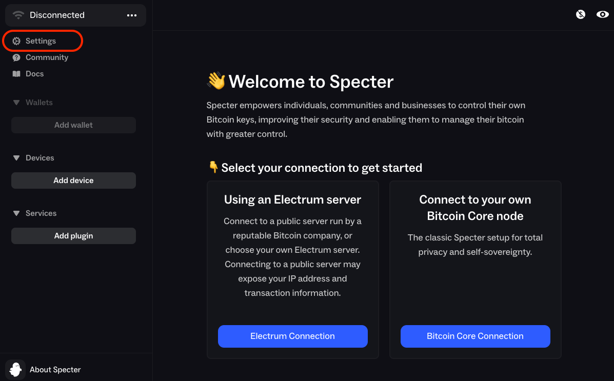
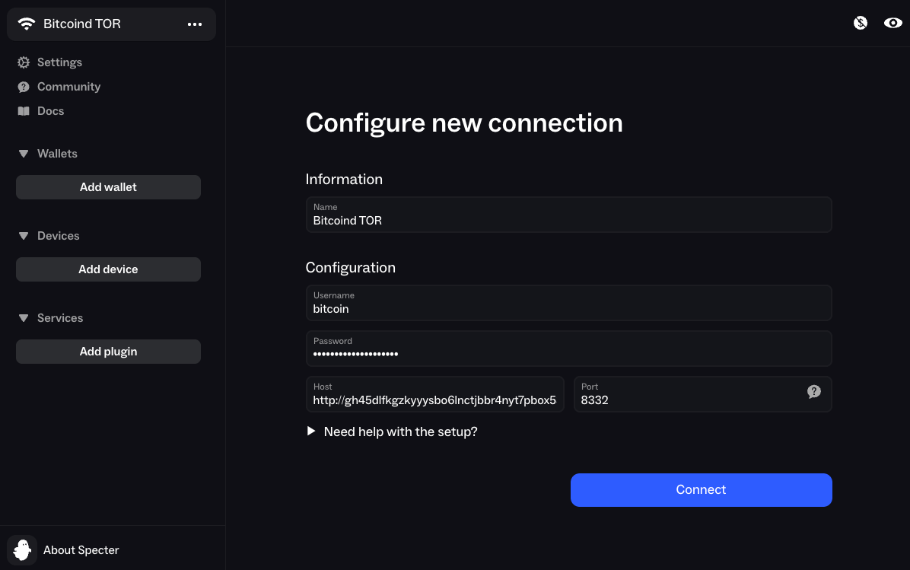

# Specter

**Available For**

- Mac
- Linux
- Windows

**Contents**

- [Specter Desktop](#specter-desktop)

**Instructions**

## Specter Desktop

1. If this is your first time using Specter, you will be shown a screen to pick a connection method. But we'll skip this for now and set up Tor.

   

1. Click `Settings` and select the `Tor` tab.

   - If you have Tor running as [local Proxy](https://docs.start9.com/user-manual/connecting-remotely/tor.html#running-tor-in-the-background-on-your-phonelaptop) scroll down and select `Custom`

     - Enter or leave the URL as `socks5h://localhost:9050`

     - Click `Test connection` - if it fails, please review your Tor proxy

   - If you don't have Tor running in the background of your system, select `Built-in`

     - Click `Set Up`, then `Setup Tor`

   - then click the `Save` button

### Connecting to Bitcoin Knots 

1. Click the `...` menu and click `+ Add Connection`

1. In the `Username` and `Password` fields, enter a new user and password that you will now generate and copy from StartOS at `Services > Bitcoin Knots > Actions > Generate RPC Credentials`

   

1. In `Host`, enter your Bitcoin Knots RPC Interface Tor Address (found in `Services > Bitcoin Knots > Interfaces`).

1. In `Port`, enter `8332` and click `Connect`

### Connecting to Electrs

To connect to Electrs, see the Electrs [documentation](https://github.com/Start9Labs/electrs-startos/docs/instructions.md)
